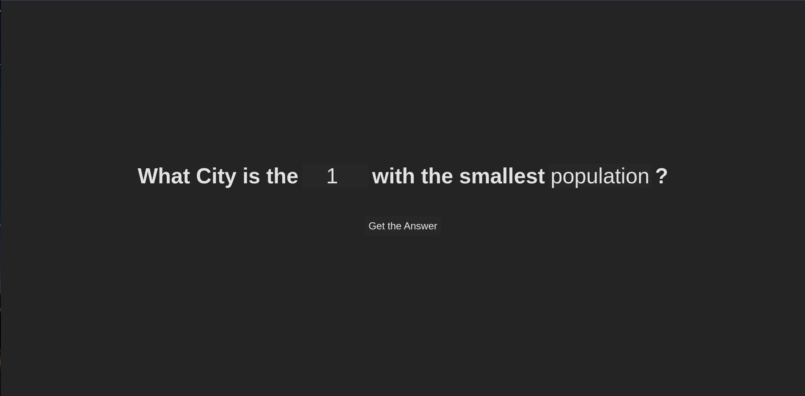
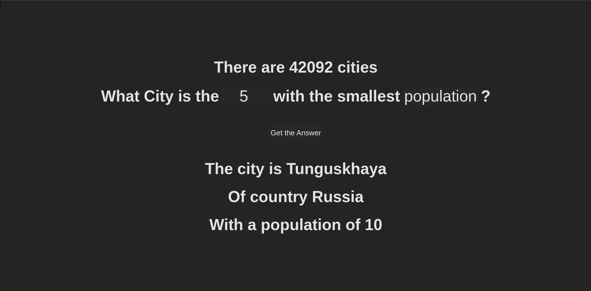
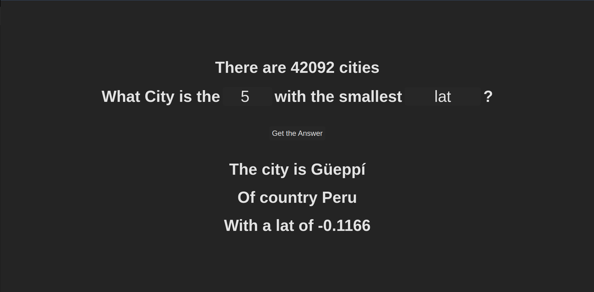

# WhatCity...?

**Número da Lista**: 6<br>
**Conteúdo da Disciplina**: Dividir e Conquistar<br>

## Alunos
|Matrícula | Aluno |
| -- | -- |
| 19/0056843  |  Carlos Eduardo de Sousa Fiuza |
| 19/0055201  |  Matheus Calixto Vaz Pinheiro |

## Sobre 
Este projeto tem como objetivo utilizar de um algoritmo de mediana das medianas para encontrar a menor cidade de acordo com o atributo escolhido pelo usuário.

## Screenshots
<div align="center">
    </img>
</div>
<br/>
<div align="center">
    </img>
</div>
<br/>
<div align="center">
    </img>
</div>

## Instalação 
**Linguagem**: javascript<br>
**Framework**: React<br>
npm ou yarn

## Uso 
Pode ser acessado pelo link: [https://dc-what-city.vercel.app](https://dc-what-city.vercel.app)


ou


Após clonar o repositório executar no terminal os seguintes comandos para instalar as dependências e iniciar o projeto:

    ```bash
    cd WhatCity...
    yarn
    yarn dev
    ```

## Apresentação
https://github.com/projeto-de-algoritmos/DC_WhatCity/blob/dfb048f063347a332d077e677d98a9c2e0322733/WhatCity/src/assets/presentation.mp4
